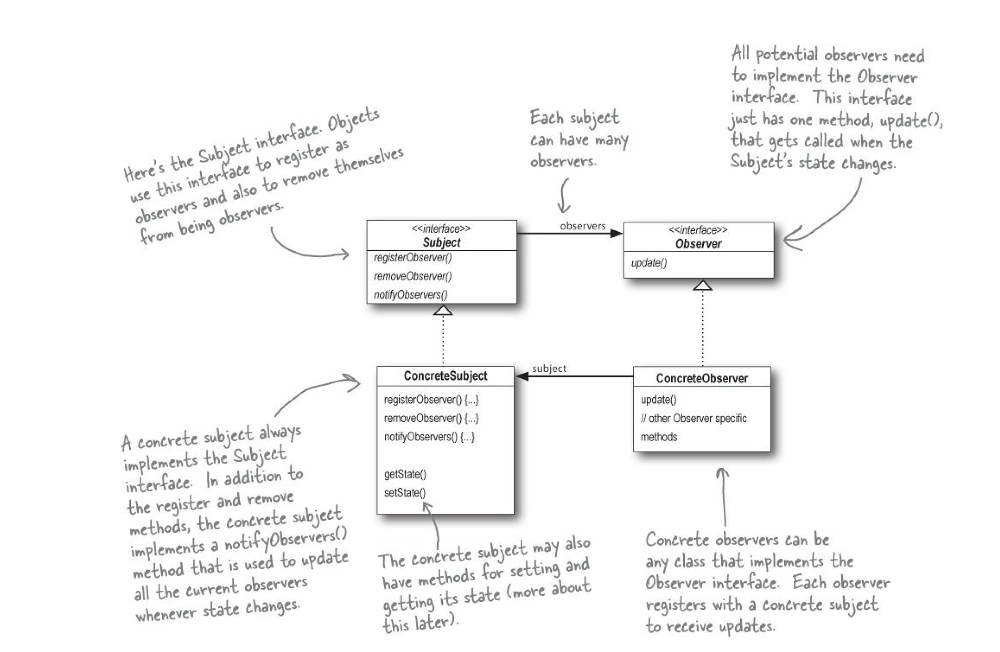

# Notes on Software Design Patterns from Head First Design Patterns

## **Principle of Object Oriented Programming:** 
Program to an interface, not to an implementation. Separate the aspects of the application that change and separate them from the aspects that remain the same. The changing behaviour can be turned into an interface and the main class can encapsulate it in the form of member variables.

```java
public abstract class Duck {
    private String name;
    private int age;
    private FlyBehaviour flyBehaviour;
    private QuackBehaviour quackBehaviour;

    public Duck(String name, int age) {
        this.name = name;
        this.age = age;
    }
    public void performQuack() {
        quackBehaviour.quack();
    }

    public void performFlying() {
        flyBehaviour.fly();
    }

};

interface FlyBehaviour {
    public void fly();

}

class FlyWithWings implements FlyBehaviour {
    public void fly() {
        System.out.println("FLying");
    }
}

class flyNoWay implements FlyBehaviour {
    public void fly() {
        // DO nothing
    }
}

interface QuackBehaviour {
    public void quack();
}

class Quack implements QuackBehaviour {
    public void quack() {
        System.out.println("Quacking...");
    }
}

class MuteQuack implements QuackBehaviour {
    public void quack() {
        // Do nothing
    }
}

class Squeak implements QuackBehaviour {
    public void quack() {
        System.out.println("Squeaking...");
    }
};

```
In the example above, the `Duck` class, `quacking` and `flying` are changing behaviours. To avoid changes in the `Duck` class due to the possible introduction of new duck types, the changing behaviors have been extracted and turned into separate classes that are encapsulated by the main class.The interfaces may be replaced by abstract classes to serve the same purpose. This technique is known as `Composition`.

## **The Strategy Pattern**:
 The strategy pattern defines a family of algorithms, encapsulates each one, and make them interchangeable. An example is the multiple duck behaviours defined and encapsulated above.The algorithm can vary independently from the client that uses it and the client can change without changing the algorithms.

 ## **The Observer Pattern**:
It depends a one-to-many dependency between objects such that when one object changes state, all of its dependents are notified and updated automatically.



below is a general implementation of the observer pattern:

```java
public interface Subject {
    public void registerObserver(Observer o);

    public void removeObserver(Observer o);

    public void notifyObserver();

};
public class ConcreteSubject implements Subject {
    private ArrayList<Observer> observers;

    // additional member variables
    public ConcreteSubject() {
        // constructor
        observers = new ArrayList<Observer>();
    }

    public void registerObserver(Observer o) {
        observers.add(o);
    };

    public void removeObserver(Observer o) {
        observers.remove(o);
    };

    public void notifyObserver() {
        for (Observer o : observers) {
            o.update();
        }
    }

};

public interface Observer {
    public void update();
    
};


public class ConcreteObserver  implements Observer{

    public void update(){
        //Implementation
    }
    
}
```


## **The Decorator Pattern**:


